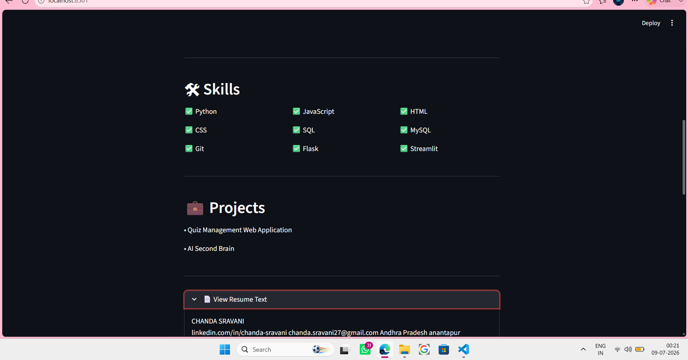

## Screenshots

### Home Page


### Extracted Resume Details



## Features

- Upload PDF Resume
- Extract Name
- Extract Email
- Extract Phone Number
- Extract Education
- Extract Skills
- Extract Project Names

## Technologies Used

- Python
- Streamlit
- pdfplumber
- Regular Expressions (Regex)

## Installation

```bash
pip install -r requirements.txt
```

## Run the Project

```bash
streamlit run app.py
```

## Project Structure

```
Resume-Parser/
│── app.py
│── parser.py
│── requirements.txt
│── README.md
```